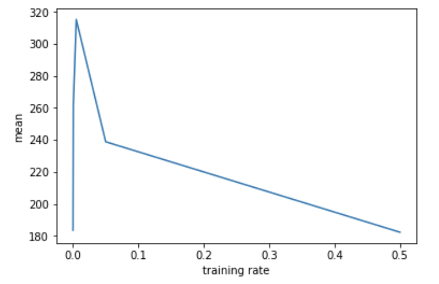
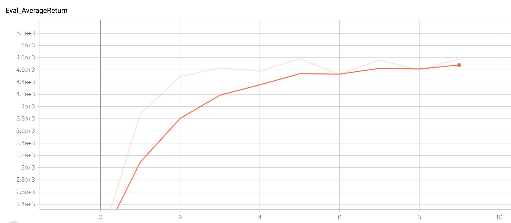
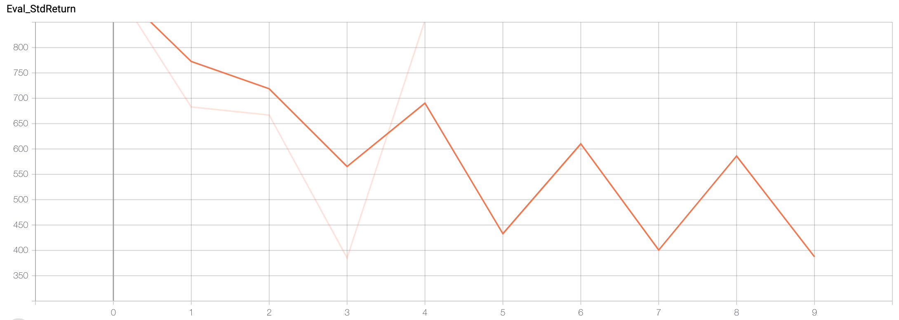
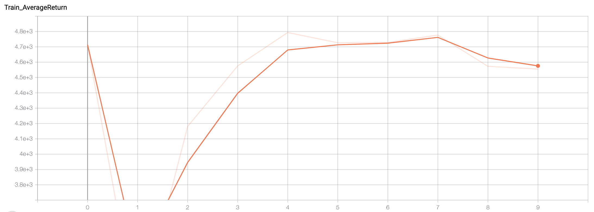
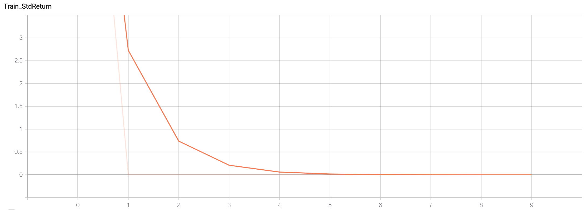

## Part 1.2
|                           | Ant               | Hopper             | Humanoid           | Walker             |  Half Cheetah     | Only difference was train rate. Everything else was the same                                                        |
|---------------------------|-------------------|--------------------|--------------------|--------------------|-------------------|---------------------------------------------------------------------------------------------------------------------|
| mean (Eval_AverageReturn) | 409.9525451660156 | 134.20379638671875 | 248.94525146484375 | 284.9465026855469  | 3129.36083984375  | batch_size:          1000   Learning Rate:       5e-2   train_batch_size:    1000   eval_batch_size:    20000   ... |
| std  (Eval_StdReturn)     | 490.24609375      | 111.58010864257812 | 53.95016098022461  | 200.73924255371094 | 546.7034912109375 | batch_size:          1000   Learning Rate:       5e-2   train_batch_size:    1000   eval_batch_size:    20000   ... |
| mean (Eval_AverageReturn) | 2916.05078125     | 861.6389770507812  | 296.31707763671875 | 908.9197387695312  | 3225.95849609375  | batch_size:          1000   Learning Rate:       5e-3   train_batch_size:    1000   eval_batch_size:    20000   ... |
| std  (Eval_StdReturn)     | 995.0602416992188 | 296.4545593261719  | 86.83833312988281  | 1415.6341552734375 | 172.926025390625  | batch_size:          1000   Learning Rate:       5e-3   train_batch_size:    1000   eval_batch_size:    20000   ... |

## Task 1.3:

For the next task, the graph shown here is a plot of the training rate vs the mean for the humanoid policy. Note that the higher the mean is correlated with the training rate to a certain extent before it becomes expensive. it works up until around e^-4. Then it trains too slowly (or found a bad minima) for almost all other policies.

## Section 2.2

Shown here is the DAgger result for the Ant case. Note that not only did it beat the pants off of behavioral cloning, but almost beat the expert training policy. The x axis is the number of Dagger iterations, wher ethe y is the avg return. While the instructions did say to show error bars for standard deviation, Mapping them to the same values is included here:

The main point is the std declined over the iterations, which is a good thing for the policy, meaning we have a tightning of the model over the policy.

Below is the mean and std of the training set. Note the sudden drop in the policy for the mean and the convergence for the std. 

